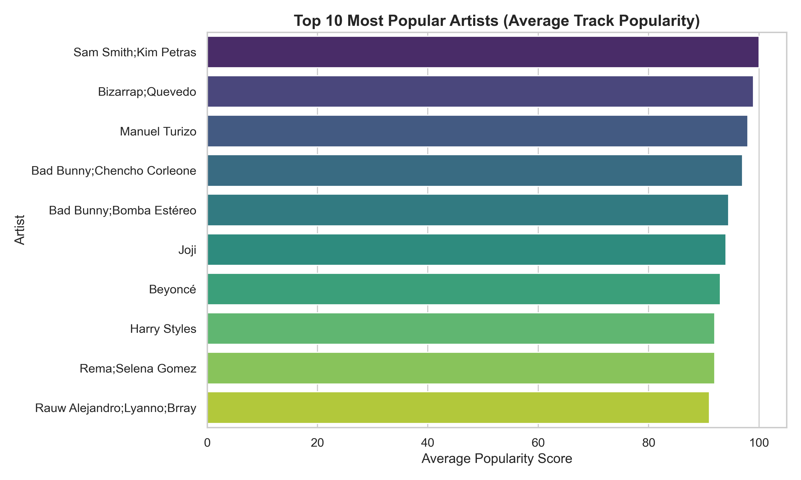
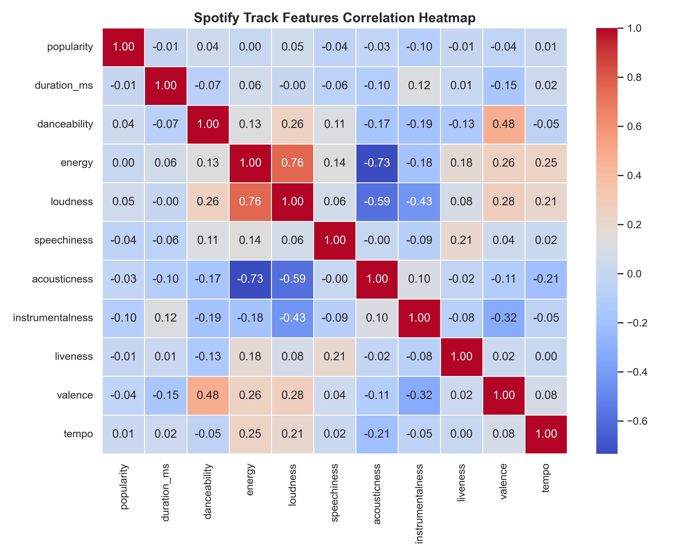

# 🎵 Spotify Data Cleaning & Visual Insights Pipeline

A reproducible, production-ready data engineering and exploratory data analysis (EDA) pipeline that cleans raw music metadata and generates high-fidelity visual insights.

## 🚀 Pipeline Architecture

This project is built to process raw track data systematically, eliminating dirty data before generating visualizations:

1. **Ingestion & Profiling:** Loads the raw dataset containing 114,000 tracks.
2. **Deduptive Cleaning (`clean.py`):** 
   * Identifies and drops null values across critical features.
   * Removes exact duplicate rows to maintain statistical integrity.
   * Exports a pristine dataset of **113,999 tracks** to `data/cleaned_spotify_data.csv`.
3. **Automated EDA (`eda.py`):** Processes the clean dataset using Pandas, Matplotlib, and Seaborn to automatically output visual assets to the `images/` directory.


## 📊 Visual Insights

### 1. Top 10 Most Popular Artists
This chart calculates the average popularity score across all tracks for each artist, highlighting the top performers in our cleaned dataset.



### 2. Feature Correlation Heatmap
A correlation matrix mapping the interactions between key musical features. This helps us see how attributes like `energy` and `loudness` scale together.




## 🛠️ How to Run the Pipeline

### Prerequisites
Ensure you have Python and your packages set up. This pipeline relies on:
* `pandas`
* `matplotlib`
* `seaborn`

### Execution
Run the data cleaning script first:
```bash
python clean.py